# 2023_filament_dryer

This page is explains the physical aspects.

These topics are not covered:
* Open Hardware and Open Software...
* How to build
* User Guide
* How to run grafana etc.

## Introduction

This filament dryer is used to dry 3D printer filament.

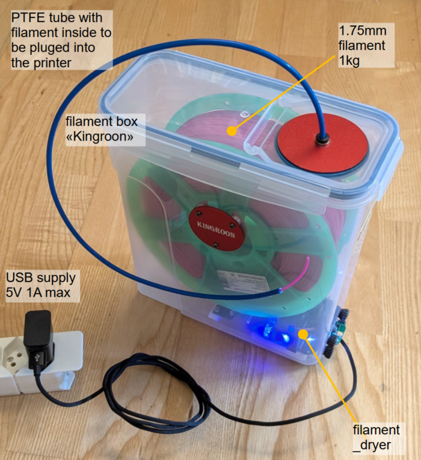

A plastic box (Aliexpress, Kingroon, USD23) is equiped with a dryer module. The module is pluged to USB power (5V, 1A max). The dryer contains about 10g of dried silicagel. A fan blows dry air around the filament. The silicagel will be automatically regenerated when saturated with water: its heated up and the wet air is blown to the enviroment.
It takes about 5 days to dry 1 kg of 1.75 mm filament.

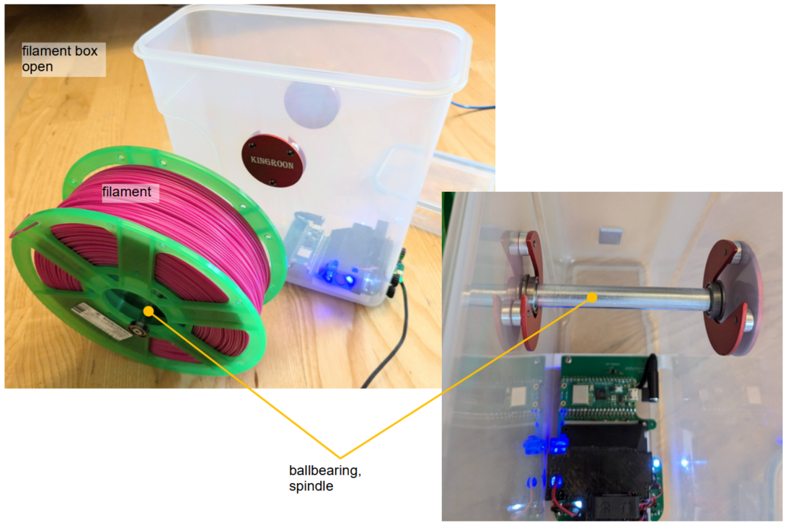

The filament roll is held by a spindle with ballbearings. 

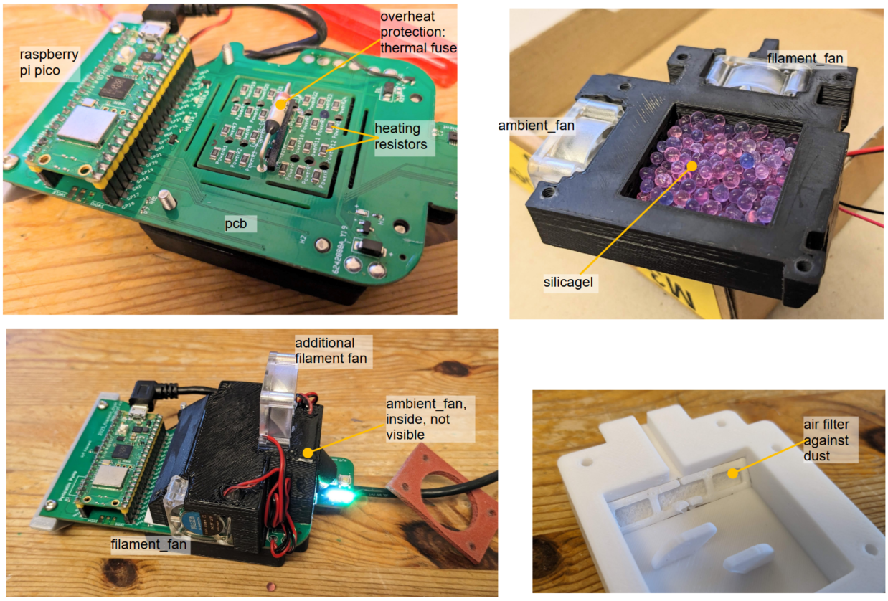

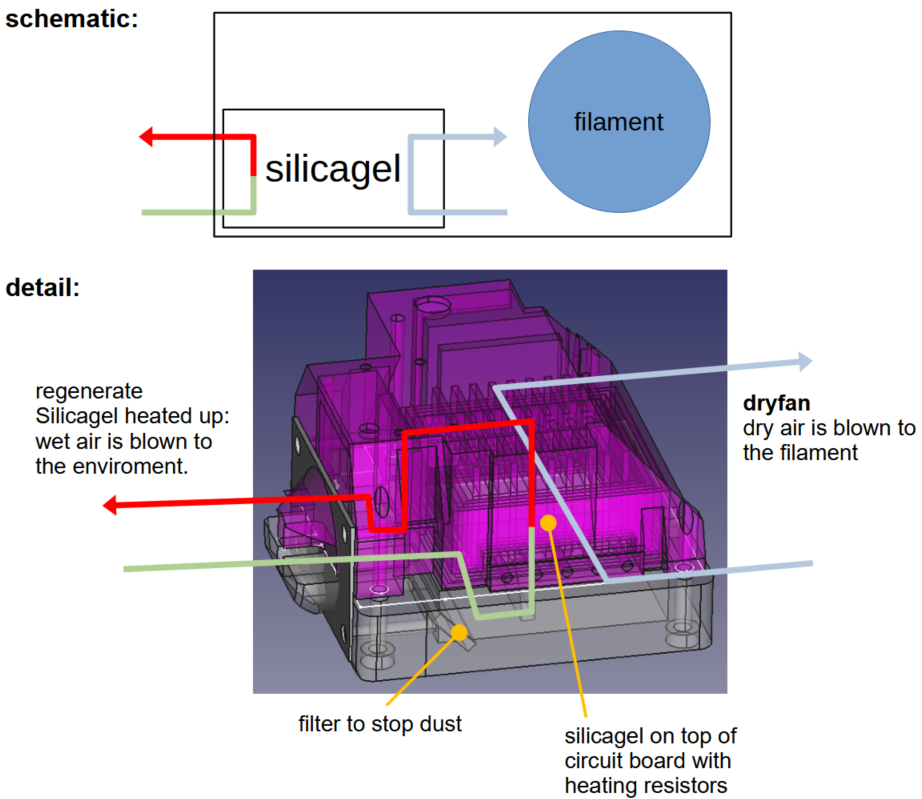

## Drying process

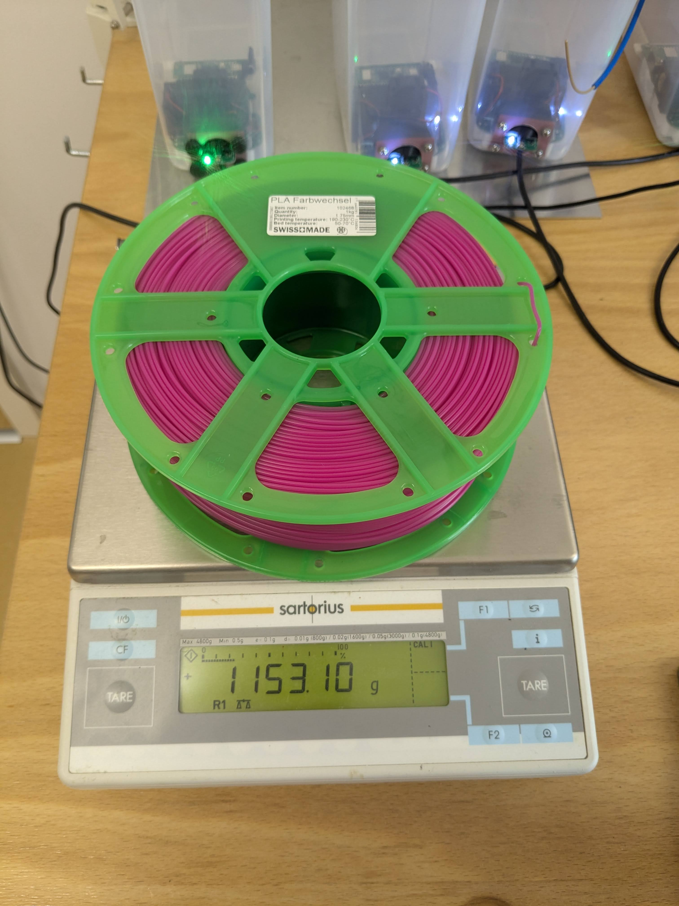

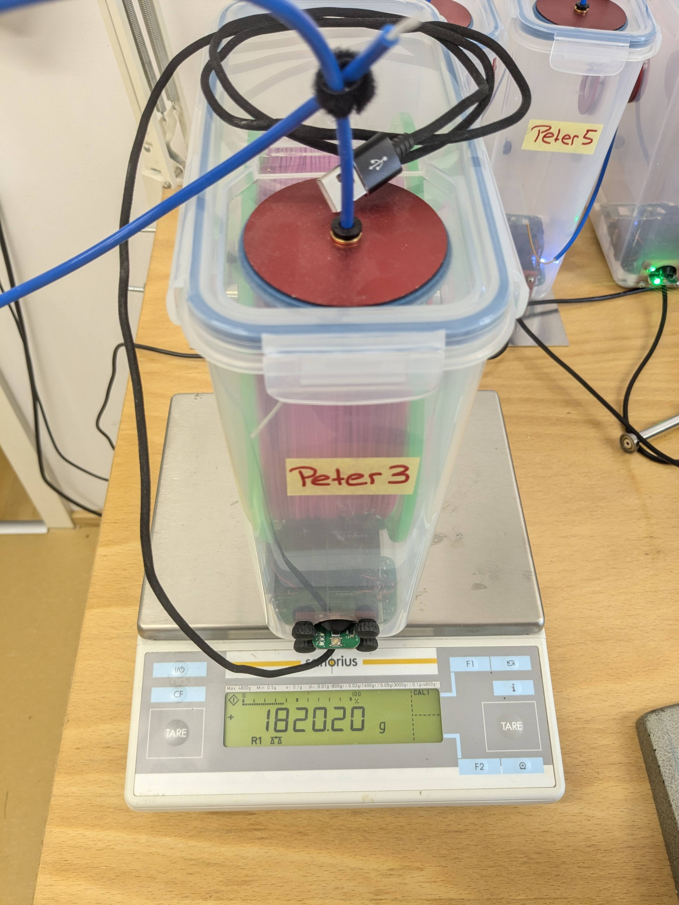

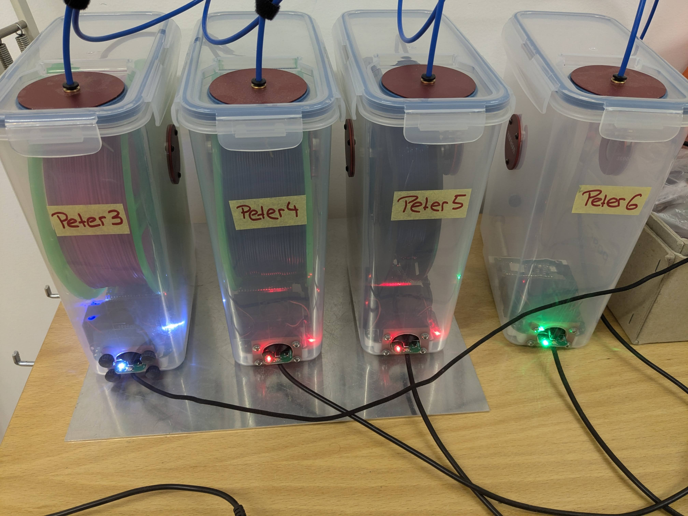

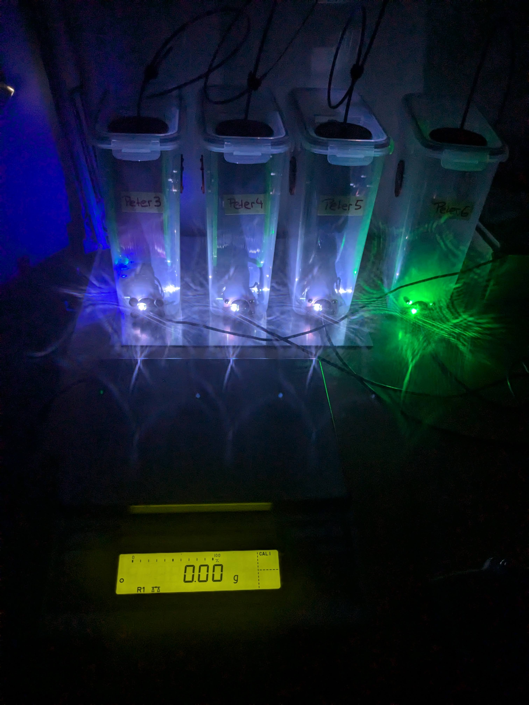

Three rolls of filament are placed in filament_dryers. PLA, PETG and TPU. The rolls have been laying around in my workshop for a long time and therefore I assume they are equally "wet". The filament_dryer is pluged in and I measure the weight of the hole dryer box over the next two weeks.
In the diagramm I show the weight reduction relative to the filament weight (1 kg for example).

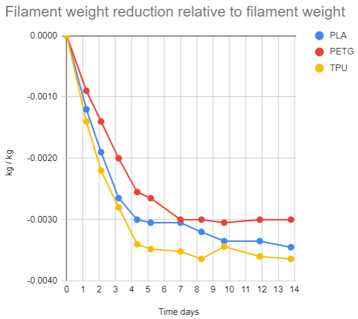

Filament types
* PLA	Pink	PLA 1.75 mm 102468 Purefil 1kg
* PETG	dunkelblau	PETG 1.75 mm 102478 Purefil 1 kg
* TPU	blau_transparent	TPU 1.75 mm LOT 20221216 Aliexpress 0.5 kg

### Conclusion

* All of the tested Filaments loose about 3 gramm water per kg filament over a week. I assume the water content after a week is low and perfect for printing.
* The fluctuation of the weight after day 6 is not a measuring error. It is due to the regeneration cycle of the dryer. Water goes into the dry box through the plastic walls or air gaps and gets out through the regenation cycle every few days.

### Drying details

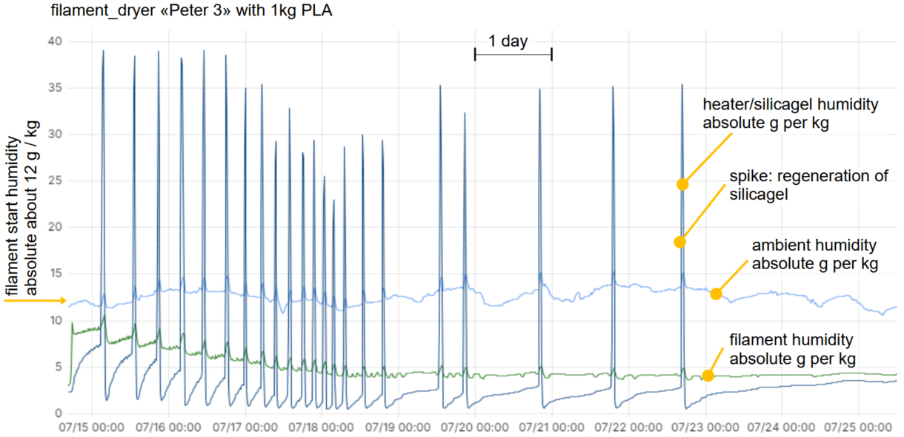
As an example the details of the drying over two weeks are shown.
I do show the absolute water content of the air in g per kg of air. 1 kg air corresponds to about 1 m3 air. The absolute humidity does not depend on temperature and after playing around with different himidity units for a long time, I decided to prefer this unit.

The humidity of the air around the filament changes from 12 g/kg at the start (the filament was laying around in my workshop at this himidity, ambient) to 4 g/kg after one week.

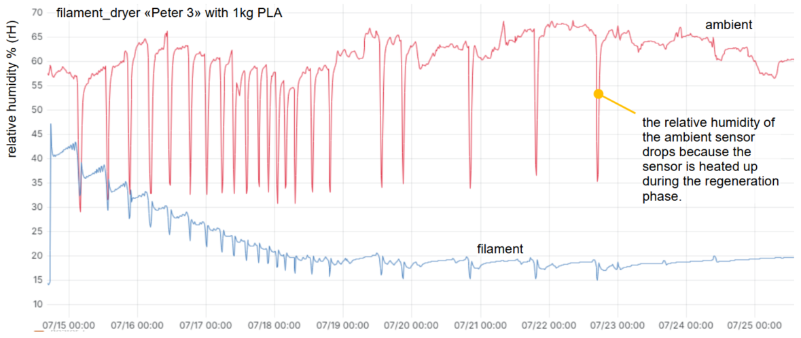
The relative humidity in my workshop is in the range of 60%. The relative humidity of the air arount the filament is decreased down to below 20%.

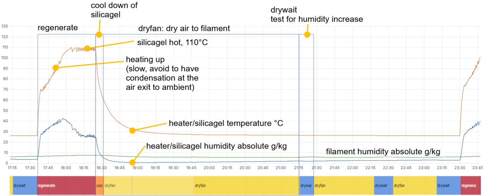
One cycle of regeneration and drying.

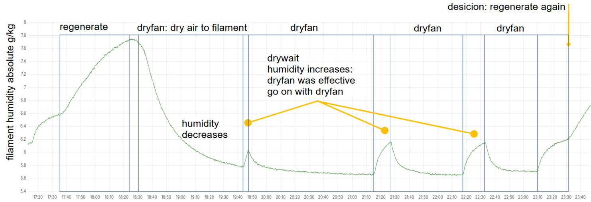
The decision how to proceed is made due to changes of measurenents. If we only observe changes we are not sensitive to measurements errors/offsets. 

# Grafana
It is possible to log to grafana.
[Example](http://www.maerki.com:3000/goto/Yx-3weXSR?orgId=1)
