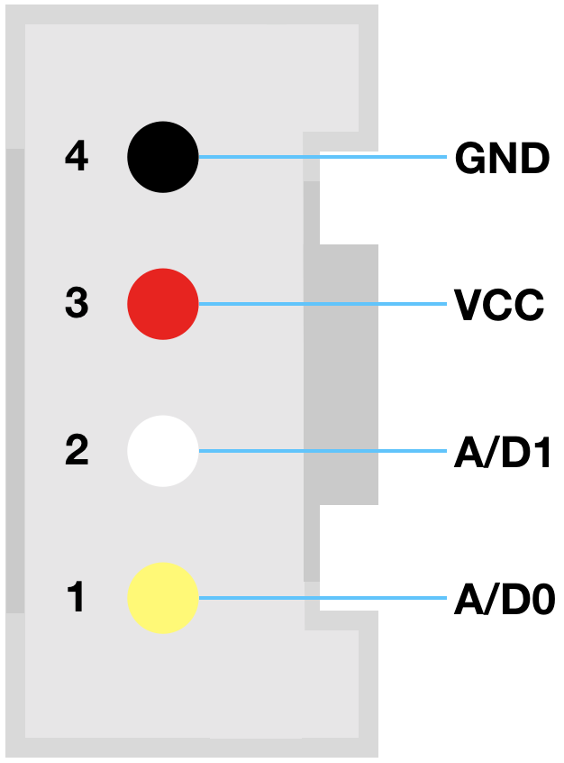
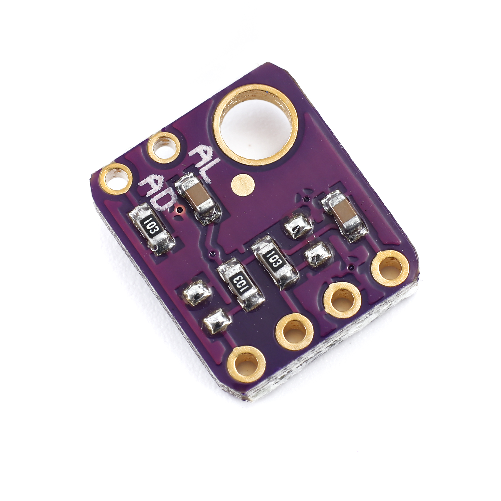
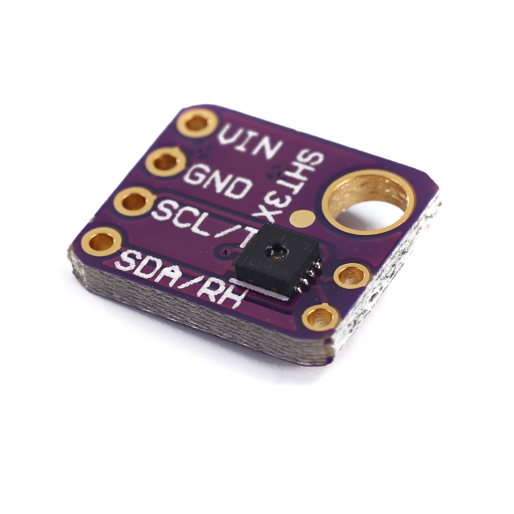
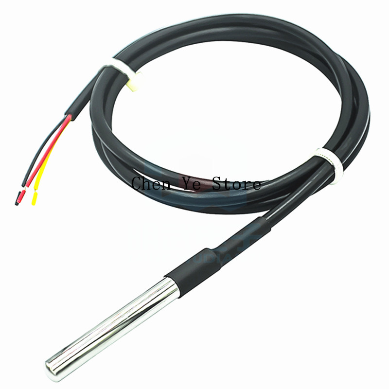

# Grove

# SHT 31

| pin | color | I2C | 1-wire |
| - | :-: | - | :-: |
| pin1 | yellow | SCL | 1-wire |
| pin2 | white | SDA | - |
| pin3 | red | VCC | VCC |
| pin4 | black | GND | GND |

# DS18b20

